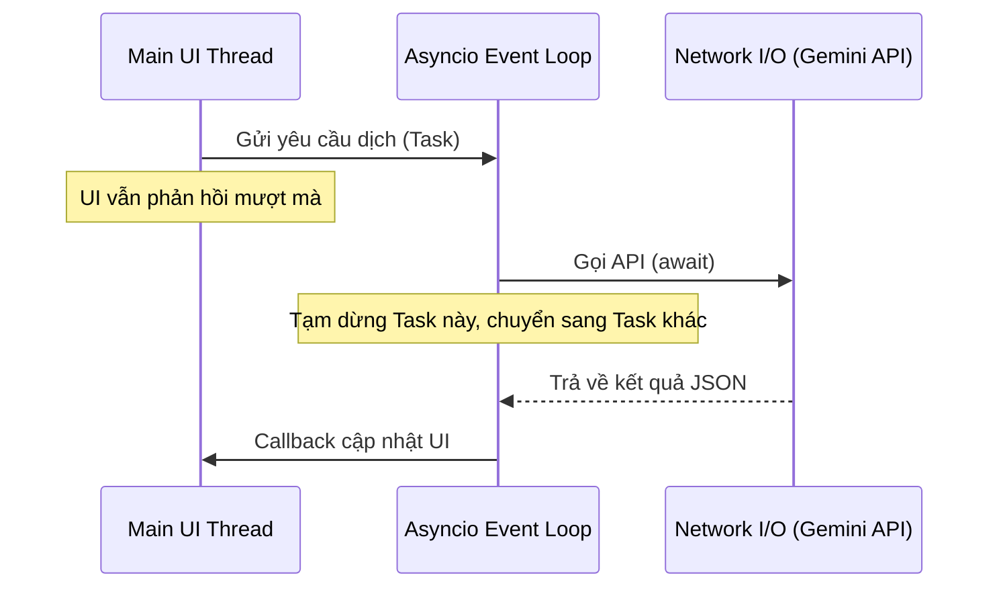
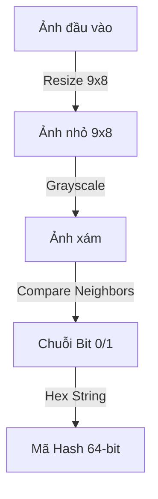
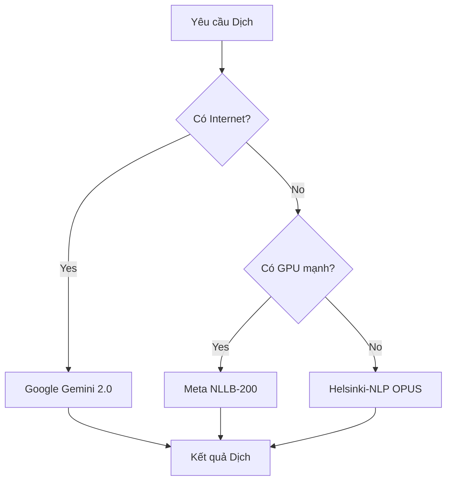

# CHƯƠNG 2: CƠ SỞ LÝ THUYẾT VÀ CÔNG NGHỆ

Chương này trình bày các cơ sở lý thuyết nền tảng và các công nghệ cụ thể được áp dụng để giải quyết bài toán của dự án. Nội dung được cấu trúc đi từ các khái niệm lý thuyết khoa học, minh họa bằng các sơ đồ quy trình, đến việc phân tích và triển khai công nghệ thực tế trong mã nguồn.

## 2.1. Cơ sở lý thuyết về Ngôn ngữ và Framework phát triển

### 2.1.1. Ngôn ngữ Python và Hệ sinh thái
Python là một ngôn ngữ lập trình bậc cao, thông dịch và hướng đối tượng, nổi bật với khả năng xử lý dữ liệu mạnh mẽ. Trong dự án này, Python đóng vai trò là xương sống kết nối các thành phần xử lý ảnh, trí tuệ nhân tạo và giao diện người dùng. Việc lựa chọn Python 3.8+ cho phép nhóm phát triển tiếp cận hệ sinh thái thư viện phong phú như `google-generativeai` cho AI hay `numpy` cho tính toán ma trận. Mặc dù là ngôn ngữ thông dịch, Python cho phép tích hợp sâu với các thư viện C/C++ (như OpenCV, PyQt) để đảm bảo hiệu năng cho các tác vụ tính toán nặng.

### 2.1.2. Lập trình Bất đồng bộ (Asynchronous Programming)
Để giải quyết bài toán hiệu năng trong ứng dụng thời gian thực, dự án áp dụng mô hình lập trình bất đồng bộ thay vì đa luồng truyền thống. Về mặt lý thuyết, mô hình này sử dụng một vòng lặp sự kiện (Event Loop) đơn luồng để quản lý hàng nghìn tác vụ I/O (như gọi API mạng, đọc ghi file) mà không gây lãng phí tài nguyên cho việc chuyển đổi ngữ cảnh (context switching) giữa các luồng hệ điều hành.

Sơ đồ dưới đây mô tả cơ chế hoạt động của Event Loop trong việc xử lý các tác vụ dịch thuật mà không chặn luồng chính:



Trong mã nguồn thực tế tại `services/async_processing_service.py`, thư viện `asyncio` được sử dụng để điều phối quy trình này. Hàm `_process_region` dưới đây minh họa cách hệ thống thực hiện song song việc OCR và Dịch thuật:

```python
# services/async_processing_service.py
async def _process_region(self, region_idx, img, scan_counter):
    # Sử dụng await để không chặn luồng chính trong khi chờ I/O
    text_boxes = await self.ocr_service.process_image_with_boxes_async(img)
    
    # Các tác vụ dịch thuật cũng được thực hiện bất đồng bộ
    translated_boxes = await self.translation_service.translate_text_boxes_async(text_boxes)
    
    # Chỉ cập nhật UI khi đã có kết quả
    self.overlay_service.update_positioned_overlay(region_idx, translated_boxes)
```

### 2.1.3. Giao diện Đồ họa và Kỹ thuật Lớp phủ (Overlay)
Kỹ thuật Lớp phủ (Overlay) yêu cầu tạo ra các cửa sổ có tính chất đặc biệt: trong suốt và không cản trở tương tác chuột. Về mặt kỹ thuật, điều này đòi hỏi việc thao tác trực tiếp lên các cờ (Flags) của hệ thống cửa sổ Windows. Dự án sử dụng PyQt6 để trừu tượng hóa các thao tác phức tạp này.

Cụ thể, trong file `overlay/positioned_overlay.py`, các thuộc tính `WA_TranslucentBackground` (nền trong suốt) và `WA_TransparentForMouseEvents` (xuyên chuột) được thiết lập để đạt được hiệu ứng mong muốn:

```python
# overlay/positioned_overlay.py
def _setup_ui(self):
    # Loại bỏ viền và giữ cửa sổ luôn nổi trên cùng
    self.setWindowFlags(
        Qt.WindowType.FramelessWindowHint |
        Qt.WindowType.WindowStaysOnTopHint |
        Qt.WindowType.Tool
    )
    # Kích hoạt tính năng trong suốt và click xuyên thấu
    self.setAttribute(Qt.WidgetAttribute.WA_TranslucentBackground)
    self.setAttribute(Qt.WidgetAttribute.WA_TransparentForMouseEvents)
```

## 2.2. Cơ sở lý thuyết về Xử lý ảnh và Nhận dạng ký tự

### 2.2.1. Kỹ thuật Chụp màn hình và Windows GDI
Để tránh hiện tượng "gương vô tận" (phần mềm chụp lại chính lớp phủ của nó), dự án sử dụng kỹ thuật can thiệp vào Giao diện Thiết bị Đồ họa (GDI) của Windows thông qua hàm `BitBlt`. Phương pháp này cho phép sao chép dữ liệu điểm ảnh trực tiếp từ bộ nhớ đệm (Device Context) của cửa sổ ứng dụng đích, bỏ qua các lớp cửa sổ Overlay nằm bên trên.

Quy trình chụp ảnh màn hình bằng BitBlt được mô tả như sau:

```mermaid
flowchart LR
    Target[Cửa sổ Ứng dụng Gốc] -->|GetWindowDC| SourceDC[Device Context Nguồn]
    Mem[Bộ nhớ Đệm Ứng dụng] -->|CreateCompatibleDC| DestDC[Device Context Đích]
    SourceDC -->|BitBlt (Copy Pixel)| DestDC
    DestDC -->|Convert| Bitmap[Dữ liệu Ảnh Bitmap]
    style DestDC fill:#f9f,stroke:#333,stroke-width:2px
```

Đoạn mã thực tế trong `capture/window_capture.py` thể hiện việc khởi tạo các Device Context và thực hiện lệnh copy vùng nhớ:

```python
# capture/window_capture.py
def capture_with_printwindow(self):
    # Lấy handle của Device Context cửa sổ nguồn
    hwnd_dc = win32gui.GetWindowDC(self.hwnd)
    mfc_dc = win32ui.CreateDCFromHandle(hwnd_dc)
    
    # Tạo Device Context tương thích trong bộ nhớ
    save_dc = mfc_dc.CreateCompatibleDC()
    
    # Thực hiện Bit Block Transfer (BitBlt) để copy dữ liệu pixel
    save_dc.BitBlt((0, 0), (width, height), mfc_dc, (0, 0), win32con.SRCCOPY)
    
    return self._bitmap_to_image(save_bitmap)
```

### 2.2.2. Thuật toán Băm nhận thức (dHash)
Để tối ưu hóa hiệu năng, hệ thống cần loại bỏ các khung hình tĩnh. Dự án áp dụng thuật toán Difference Hash (dHash). Nguyên lý của dHash là so sánh độ sáng tương đối giữa các điểm ảnh liền kề, tạo ra một "vân tay" cho hình ảnh bền vững với các thay đổi nhỏ về ánh sáng hay nhiễu.

Quy trình tính toán dHash bao gồm 4 bước chính:



Mã nguồn triển khai thuật toán này trong `capture/window_capture.py` rất gọn nhẹ và hiệu quả:

```python
# capture/window_capture.py
def compute_dhash(image, hash_size=8):
    # Bước 1 & 2: Resize và chuyển xám
    gray = image.convert('L').resize((hash_size + 1, hash_size), Image.LANCZOS)
    pixels = np.array(gray)
    
    # Bước 3: So sánh pixel với pixel bên phải
    # Nếu pixel trái sáng hơn pixel phải -> True (1), ngược lại -> False (0)
    diff = pixels[:, 1:] > pixels[:, :-1]
    
    # Bước 4: Đóng gói thành chuỗi hex
    return np.packbits(diff.flatten()).tobytes().hex()
```

## 2.3. Cơ sở lý thuyết về Dịch máy và Trí tuệ nhân tạo

### 2.3.1. Chiến lược Đa tầng (Multi-tier Strategy)
Dự án áp dụng chiến lược lựa chọn mô hình dịch thuật thông minh để cân bằng giữa ba yếu tố: Chất lượng, Tốc độ và Tính sẵn sàng. Hệ thống ưu tiên sử dụng các mô hình đám mây (Cloud AI) cho chất lượng tốt nhất, và tự động chuyển sang các mô hình cục bộ (Local AI) khi gặp sự cố mạng.

Sơ đồ quyết định lựa chọn mô hình được mô tả như sau:



### 2.3.2. Triển khai Google Gemini API
Google Gemini 2.0 Flash-Lite được chọn làm mô hình chính nhờ khả năng hiểu ngữ cảnh vượt trội. Trong `translation/gemini_translator.py`, việc gọi API được bao bọc bởi các cơ chế xử lý lỗi và giới hạn tốc độ (Rate Limiting) để đảm bảo tính ổn định:

```python
# translation/gemini_translator.py
def translate(self, text, source_lang, target_lang):
    try:
        model = genai.GenerativeModel('gemini-2.0-flash-lite')
        # Prompt kỹ thuật (Prompt Engineering) để định hướng mô hình
        prompt = f"""Translate the following text from {source_lang} to {target_lang}.
                   Maintain the original meaning and context:
                   {text}"""
                   
        response = model.generate_content(prompt)
        return {'text': response.text.strip(), 'confidence': 0.95}
    except Exception as e:
        return None # Trả về None để kích hoạt Fallback sang NLLB
```

## 2.4. Cơ sở lý thuyết về Cơ sở dữ liệu

### 2.4.1. Mô hình Dữ liệu Lai (Hybrid Data Model)
Hệ thống kết hợp SQLite (cho lưu trữ cục bộ tốc độ cao) và Firebase Firestore (cho đồng bộ đám mây). Mô hình này đảm bảo dữ liệu luôn sẵn sàng ngay cả khi offline (Offline-first architecture).

Cấu trúc bảng trong SQLite (`translation_history`) được thiết kế để tối ưu cho việc truy vấn lịch sử theo thời gian thực:

```python
# firebase/local_history_service.py
def _init_db(self):
    # Tạo bảng với khóa chính và các chỉ mục (Index) quan trọng
    cursor.execute('''
        CREATE TABLE IF NOT EXISTS translation_history (
            id TEXT PRIMARY KEY,
            user_id TEXT NOT NULL,
            source_text TEXT NOT NULL,
            translated_text TEXT NOT NULL,
            timestamp TEXT NOT NULL,
            favorite INTEGER DEFAULT 0
        )
    ''')
    # Tạo Index để tăng tốc độ truy vấn sắp xếp theo thời gian
    cursor.execute('CREATE INDEX IF NOT EXISTS idx_timestamp ON translation_history(timestamp DESC)')
```
