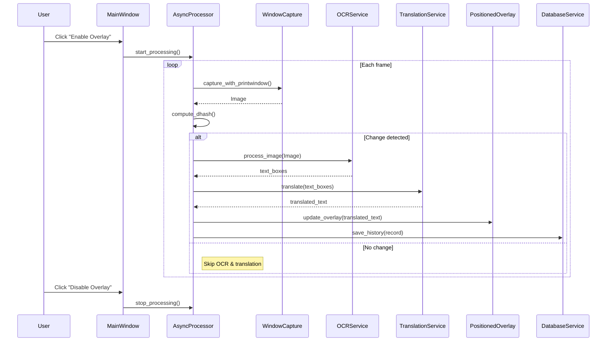

# CHƯƠNG 3: PHÂN TÍCH HỆ THỐNG

Chương này tập trung vào việc phân tích chi tiết các yêu cầu nghiệp vụ, thiết kế cơ sở dữ liệu, mô tả các trường hợp sử dụng (Use case), và trình bày các sơ đồ hoạt động cũng như sơ đồ tuần tự nhằm minh hoạ cách các thành phần của hệ thống tương tác với nhau trong quá trình dịch thời gian thực.

## 3.1. Phân tích nghiệp vụ hệ thống

Hệ thống dịch thời gian thực được thiết kế để đáp ứng nhu cầu người dùng muốn hiểu nội dung văn bản xuất hiện trên màn hình (ví dụ: phụ đề trong video, đoạn hội thoại trong game) mà không cần phải dừng lại hoặc chuyển sang một ứng dụng khác. Nghiệp vụ chính bao gồm ba bước liên tiếp: (1) chụp hình ảnh của cửa sổ mục tiêu, (2) trích xuất văn bản từ ảnh bằng OCR, và (3) dịch văn bản sang ngôn ngữ đích bằng mô hình ngôn ngữ lớn. Khi người dùng kích hoạt overlay, hệ thống sẽ liên tục thực hiện vòng lặp này, đồng thời cập nhật kết quả dịch lên lớp phủ để hiển thị ngay trên màn hình. Độ trễ tối đa được chấp nhận là dưới 500 ms để không gây gián đoạn trải nghiệm người dùng.

## 3.2. Thiết kế cơ sở dữ liệu

Đối với việc lưu trữ lịch sử dịch thuật và đồng bộ dữ liệu giữa các thiết bị, hệ thống áp dụng mô hình dữ liệu lai. Ở mức cục bộ, SQLite được dùng để lưu trữ bảng `translation_history` chứa các trường `id`, `user_id`, `source_text`, `translated_text`, `timestamp`, và `favorite`. Đoạn mã dưới đây thể hiện cách tạo bảng trong file `firebase/local_history_service.py`.

```python
# firebase/local_history_service.py
cursor.execute('''
    CREATE TABLE IF NOT EXISTS translation_history (
        id TEXT PRIMARY KEY,
        user_id TEXT NOT NULL,
        source_text TEXT NOT NULL,
        translated_text TEXT NOT NULL,
        timestamp TEXT NOT NULL,
        favorite INTEGER DEFAULT 0
    )
''')
```

Đối với đồng bộ đám mây, Firebase Firestore được sử dụng để lưu trữ tài liệu `translation_history` dưới dạng collection, cho phép truy cập thời gian thực từ các thiết bị khác nhau. Việc ghi dữ liệu lên Firestore được thực hiện trong `firebase/firebase_manager.py` như sau:

```python
# firebase/firebase_manager.py
from google.cloud import firestore

def upload_history(record):
    db = firestore.Client()
    db.collection('translation_history').document(record['id']).set(record)
```

Sự kết hợp này cho phép người dùng truy cập lịch sử dịch ngay cả khi không có kết nối mạng (SQLite) và đồng thời đồng bộ khi có mạng (Firestore).

## 3.3. Đặc tả Use case

## 3.3. Đặc tả Use case

Trước khi đi vào chi tiết, sơ đồ Use Case dưới đây cung cấp cái nhìn tổng quan về các chức năng của hệ thống và sự tương tác với các tác nhân bên ngoài.

### 3.3.1. Sơ đồ Use Case Tổng quát

```mermaid
usecaseDiagram
    actor "Người dùng (User)" as User
    package "Hệ thống OCR-AITranslate" {
        usecase "Chọn Cửa sổ Mục tiêu" as UC1
        usecase "Kích hoạt Dịch (Start Overlay)" as UC2
        usecase "Dừng Dịch (Stop Overlay)" as UC3
        usecase "Xem Lịch sử Dịch" as UC4
        usecase "Cấu hình API Key" as UC5
    }
    actor "Google Gemini API" as AI
    actor "Firebase Firestore" as Cloud

    User --> UC1
    User --> UC2
    User --> UC3
    User --> UC4
    User --> UC5

    UC2 ..> UC1 : <<include>>
    UC2 --> AI : Gửi ảnh/Nhận văn bản dịch
    UC2 --> Cloud : Đồng bộ lịch sử
    UC4 --> Cloud : Tải lịch sử
```

**Danh sách các Use Case của hệ thống:**

| STT | ID | Tên Use Case | Mô tả |
| :--- | :--- | :--- | :--- |
| 1 | UC01 | Chọn Cửa sổ Mục tiêu | Người dùng lựa chọn cửa sổ ứng dụng cần dịch từ danh sách các cửa sổ đang mở. |
| 2 | UC02 | Kích hoạt Dịch thuật | Bắt đầu quá trình chụp màn hình, OCR và dịch thuật thời gian thực trên cửa sổ đã chọn. |
| 3 | UC03 | Dừng Dịch thuật | Kết thúc quá trình dịch và đóng lớp phủ Overlay. |
| 4 | UC04 | Xem Lịch sử Dịch | Truy cập và xem lại các nội dung đã được dịch trước đó. |
| 5 | UC05 | Cấu hình Hệ thống | Thiết lập API Key cho Gemini và các tùy chọn khác. |

### 3.3.2. Đặc tả chi tiết các Use Case

Dưới đây là đặc tả chi tiết cho từng Use Case theo mẫu yêu cầu:

#### **Use case: UC01_Chọn Cửa sổ Mục tiêu**
| Mục | Nội dung |
| :--- | :--- |
| **Mục đích** | Xác định cửa sổ ứng dụng cụ thể mà người dùng muốn dịch nội dung. |
| **Mô tả** | Người dùng chọn một cửa sổ từ danh sách các ứng dụng đang chạy để hệ thống biết cần chụp màn hình và vẽ overlay lên đâu. |
| **Tác nhân** | Người dùng |
| **Điều kiện trước** | Ứng dụng OCR-AITranslate đã được khởi động. Cửa sổ mục tiêu đang mở. |
| **Luồng sự kiện chính (Basic flows)** | (1) Người dùng nhấn vào dropdown "Select Window" trên giao diện chính.<br>(2) Hệ thống liệt kê danh sách các cửa sổ đang hiển thị (có tiêu đề và không bị thu nhỏ).<br>(3) Người dùng chọn một cửa sổ từ danh sách.<br>(4) Hệ thống lưu handle của cửa sổ đã chọn và hiển thị tên cửa sổ lên giao diện. |
| **Luồng sự kiện phụ (Alternative flows)** | **Không tìm thấy cửa sổ:**<br>- Nếu danh sách trống, hệ thống thông báo "No active windows found" và yêu cầu người dùng mở ứng dụng khác.<br>**Người dùng nhập thủ công:**<br>- Người dùng có thể nhập một phần tên cửa sổ vào ô tìm kiếm để lọc danh sách. |
| **Điều kiện sau** | Cửa sổ mục tiêu được xác định, sẵn sàng cho việc kích hoạt Overlay. |

#### **Use case: UC02_Kích hoạt Dịch thuật**
| Mục | Nội dung |
| :--- | :--- |
| **Mục đích** | Bắt đầu quá trình dịch thời gian thực trên cửa sổ đã chọn. |
| **Mô tả** | Kích hoạt lớp phủ (overlay), bắt đầu vòng lặp chụp màn hình, OCR và dịch thuật tự động. |
| **Tác nhân** | Người dùng, Hệ thống, Google Gemini API |
| **Điều kiện trước** | Đã chọn cửa sổ mục tiêu (UC01). Đã cấu hình API Key (UC05). |
| **Luồng sự kiện chính (Basic flows)** | (1) Người dùng nhấn nút "Start Overlay".<br>(2) Hệ thống kiểm tra handle cửa sổ mục tiêu. Nếu hợp lệ, hệ thống khởi tạo cửa sổ Overlay trong suốt phủ lên trên.<br>(3) Hệ thống bắt đầu vòng lặp xử lý nền (Background Thread).<br>(4) Hệ thống chụp ảnh màn hình và so sánh dHash.<br>(5) Nếu có thay đổi, hệ thống thực hiện OCR và gửi văn bản đến Gemini API.<br>(6) Hệ thống nhận kết quả và vẽ văn bản dịch lên Overlay. |
| **Luồng sự kiện phụ (Alternative flows)** | **Cửa sổ mục tiêu bị đóng:**<br>- Hệ thống phát hiện handle không còn tồn tại, tự động dừng Overlay và thông báo lỗi.<br>**Mất kết nối mạng:**<br>- Hệ thống chuyển sang sử dụng mô hình NLLB (Offline) và hiển thị biểu tượng "Offline" trên Overlay. |
| **Điều kiện sau** | Lớp phủ hiển thị nội dung dịch theo thời gian thực. |

#### **Use case: UC03_Dừng Dịch thuật**
| Mục | Nội dung |
| :--- | :--- |
| **Mục đích** | Kết thúc phiên dịch và giải phóng tài nguyên. |
| **Mô tả** | Người dùng tắt lớp phủ dịch thuật khi không còn nhu cầu sử dụng. |
| **Tác nhân** | Người dùng |
| **Điều kiện trước** | Hệ thống đang trong trạng thái dịch (Overlay đang bật). |
| **Luồng sự kiện chính (Basic flows)** | (1) Người dùng nhấn nút "Stop Overlay" trên giao diện chính hoặc phím tắt quy định.<br>(2) Hệ thống dừng vòng lặp xử lý nền.<br>(3) Hệ thống đóng cửa sổ Overlay.<br>(4) Hệ thống lưu trạng thái phiên làm việc. |
| **Luồng sự kiện phụ (Alternative flows)** | **Tắt đột ngột:**<br>- Nếu người dùng tắt ứng dụng chính, hệ thống tự động thực hiện quy trình dừng dịch trước khi thoát hoàn toàn. |
| **Điều kiện sau** | Overlay biến mất, hệ thống trở về trạng thái chờ. |

#### **Use case: UC04_Xem Lịch sử Dịch**
| Mục | Nội dung |
| :--- | :--- |
| **Mục đích** | Xem lại các nội dung đã được dịch trước đó. |
| **Mô tả** | Người dùng truy cập danh sách lịch sử được lưu trong cơ sở dữ liệu để tra cứu lại thông tin. |
| **Tác nhân** | Người dùng, Firebase Firestore |
| **Điều kiện trước** | Đã có ít nhất một lần dịch thành công được lưu trữ. |
| **Luồng sự kiện chính (Basic flows)** | (1) Người dùng nhấn tab "History".<br>(2) Hệ thống tải dữ liệu từ SQLite (local) và hiển thị danh sách.<br>(3) Hệ thống đồng bộ ngầm với Firestore để lấy dữ liệu mới nhất từ các thiết bị khác (nếu có).<br>(4) Người dùng có thể cuộn, tìm kiếm hoặc xóa các bản ghi. |
| **Luồng sự kiện phụ (Alternative flows)** | **Không có dữ liệu:**<br>- Hệ thống hiển thị thông báo "No history available". |
| **Điều kiện sau** | Danh sách lịch sử được hiển thị cập nhật. |

#### **Use case: UC05_Cấu hình Hệ thống**
| Mục | Nội dung |
| :--- | :--- |
| **Mục đích** | Thiết lập các tham số hoạt động cho hệ thống. |
| **Mô tả** | Người dùng nhập API Key, chọn ngôn ngữ nguồn/đích và tùy chỉnh giao diện. |
| **Tác nhân** | Người dùng |
| **Điều kiện trước** | Ứng dụng đang chạy. |
| **Luồng sự kiện chính (Basic flows)** | (1) Người dùng vào menu "Settings".<br>(2) Người dùng nhập Google Gemini API Key.<br>(3) Người dùng chọn ngôn ngữ nguồn (ví dụ: Tiếng Anh) và ngôn ngữ đích (ví dụ: Tiếng Việt).<br>(4) Người dùng nhấn "Save".<br>(5) Hệ thống lưu cấu hình vào file `config.json` hoặc Registry. |
| **Luồng sự kiện phụ (Alternative flows)** | **API Key không hợp lệ:**<br>- Hệ thống kiểm tra thử (validate) key. Nếu lỗi, thông báo "Invalid API Key" và yêu cầu nhập lại. |
| **Điều kiện sau** | Cấu hình mới được áp dụng cho các lần dịch tiếp theo. |

## 3.4. Sơ đồ hoạt động

Sơ đồ hoạt động (Activity Diagram) dưới đây mô tả chi tiết luồng xử lý nghiệp vụ của hệ thống. Biểu đồ sử dụng các ký hiệu chuẩn UML: hình thoi đại diện cho các quyết định (Decision), hình chữ nhật bo tròn đại diện cho các hành động (Action), và các mũi tên chỉ hướng luồng đi.

Quy trình bắt đầu khi người dùng kích hoạt tính năng. Hệ thống sẽ kiểm tra tính hợp lệ của cửa sổ mục tiêu trước khi đi vào vòng lặp xử lý chính. Trong vòng lặp, các quyết định quan trọng như "Có thay đổi nội dung không?" (để tối ưu hiệu năng) và "Có kết nối mạng không?" (để chọn mô hình dịch) được thực hiện tự động.

```mermaid
flowchart TD
    Start((Start)) --> UserAction[Người dùng Bật Overlay]
    UserAction --> Identify[Xác định Cửa sổ Mục tiêu]
    Identify --> CheckWindow{Cửa sổ Hợp lệ?}
    CheckWindow -- Không --> Error[Báo lỗi & Dừng] --> Stop((End))
    CheckWindow -- Có --> InitOverlay[Khởi tạo Overlay Trong suốt]
    
    InitOverlay --> LoopStart(Bắt đầu Vòng lặp Xử lý)
    LoopStart --> Capture[Chụp ảnh màn hình (BitBlt)]
    Capture --> CalcHash[Tính toán dHash]
    
    CalcHash --> CheckChange{Nội dung Thay đổi?}
    CheckChange -- Không --> Delay[Chờ 50ms] --> CheckStop
    CheckChange -- Có --> OCR[Thực hiện OCR (Tesseract)]
    
    OCR --> CheckNet{Có Internet?}
    CheckNet -- Có --> CloudAI[Dịch bằng Gemini API]
    CheckNet -- Không --> LocalAI[Dịch bằng NLLB/OPUS]
    
    CloudAI --> UpdateUI[Cập nhật Giao diện Overlay]
    LocalAI --> UpdateUI
    
    UpdateUI --> SaveDB[Lưu lịch sử vào SQLite]
    SaveDB --> SyncCloud[Đồng bộ lên Firestore]
    
    SyncCloud --> CheckStop{Người dùng Tắt?}
    CheckStop -- Không --> LoopStart
    CheckStop -- Có --> Stop
```

**Diễn giải chi tiết quy trình hoạt động:**

1.  **Giai đoạn Khởi tạo (Initialization Phase):**
    *   Quy trình bắt đầu khi người dùng chọn một cửa sổ ứng dụng (ví dụ: trình phát video hoặc game) và nhấn nút "Start Overlay".
    *   Hệ thống thực hiện kiểm tra tính hợp lệ của cửa sổ (handle tồn tại, không bị thu nhỏ). Nếu không hợp lệ, quy trình kết thúc ngay lập tức với thông báo lỗi.
    *   Nếu hợp lệ, một cửa sổ Overlay trong suốt được khởi tạo, phủ khớp hoàn toàn lên vị trí của cửa sổ mục tiêu.

2.  **Vòng lặp Xử lý Chính (Main Processing Loop):**
    *   **Chụp ảnh & Phát hiện thay đổi:** Hệ thống liên tục chụp ảnh màn hình (sử dụng kỹ thuật BitBlt tốc độ cao). Để tiết kiệm tài nguyên CPU, thuật toán dHash được sử dụng để so sánh ảnh hiện tại với ảnh trước đó. Nếu chỉ số sai biệt (Hamming distance) bằng 0, hệ thống sẽ bỏ qua các bước xử lý tiếp theo và chờ 50ms trước khi lặp lại.
    *   **Xử lý OCR:** Khi phát hiện thay đổi nội dung, ảnh được gửi đến module Tesseract OCR để nhận dạng văn bản và trích xuất tọa độ (Bounding Boxes).
    *   **Quyết định Dịch thuật thông minh:** Hệ thống kiểm tra kết nối Internet.
        *   *Nếu có mạng:* Sử dụng **Gemini API** để đảm bảo chất lượng dịch tốt nhất và hiểu ngữ cảnh.
        *   *Nếu mất mạng:* Tự động chuyển sang mô hình **NLLB/OPUS** chạy cục bộ (Offline) để đảm bảo tính liên tục của dịch vụ.

3.  **Giai đoạn Cập nhật & Lưu trữ:**
    *   Kết quả dịch được vẽ lại lên Overlay tại đúng vị trí của văn bản gốc.
    *   Dữ liệu dịch được lưu vào cơ sở dữ liệu SQLite cục bộ để truy xuất nhanh lịch sử.
    *   Đồng thời, một tiến trình nền sẽ đồng bộ dữ liệu này lên Firebase Firestore để lưu trữ đám mây.

4.  **Kết thúc:**
    *   Vòng lặp tiếp tục cho đến khi người dùng nhấn nút "Stop" hoặc đóng ứng dụng.

## 3.5. Sơ đồ tuần tự

Sơ đồ tuần tự (Sequence Diagram) minh hoạ chi tiết các tương tác giữa các thành phần phần mềm trong một vòng lặp dịch. Các đối tượng tham gia bao gồm `User`, `MainWindow` (giao diện PyQt6), `PositionedOverlay`, `WindowCapture`, `OCRService`, `TranslationService`, `AsyncProcessor`, và `DatabaseService`. Các thông điệp chính được mô tả như sau:

1. Người dùng nhấn nút bật overlay trên `MainWindow`.
2. `MainWindow` khởi tạo `AsyncProcessor` và truyền lệnh `start_processing`.
3. `AsyncProcessor` gọi `WindowCapture.capture_with_printwindow()` để lấy khung hình.
4. `WindowCapture` trả về `Image` cho `AsyncProcessor`.
5. `AsyncProcessor` sử dụng `HashChangeDetector.compute_dhash()` để kiểm tra thay đổi.
6. Nếu có thay đổi, `AsyncProcessor` gọi `OCRService.process_image()` để nhận `text_boxes`.
7. `AsyncProcessor` gửi `text_boxes` tới `TranslationService.translate()`; dịch vụ này lựa chọn mô hình (Gemini/NLLB/OPUS) dựa trên kết nối.
8. Kết quả dịch được trả về và `AsyncProcessor` cập nhật `PositionedOverlay.update_overlay()` để hiển thị.
9. Đồng thời, `AsyncProcessor` gọi `DatabaseService.save_history()` để lưu vào SQLite và đồng bộ lên Firestore.
10. Vòng lặp tiếp tục cho đến khi người dùng tắt overlay.



Sơ đồ trên cho thấy cách các thành phần bất đồng bộ phối hợp để duy trì tốc độ phản hồi nhanh, đồng thời giảm tải khi không có thay đổi nội dung trên màn hình. Các quyết định về mô hình dịch thuật và việc ghi lịch sử được thực hiện một cách linh hoạt, đáp ứng yêu cầu tính sẵn sàng và bảo mật dữ liệu.

---

Với các phân tích trên, chương 3 đã cung cấp một cái nhìn toàn diện về nghiệp vụ, cấu trúc dữ liệu, mô tả các trường hợp sử dụng, và các sơ đồ mô hình hoá hành vi hệ thống. Nội dung này sẽ là nền tảng vững chắc cho chương 4, nơi chúng ta sẽ đi sâu vào thiết kế chi tiết và triển khai các thành phần phần mềm.
