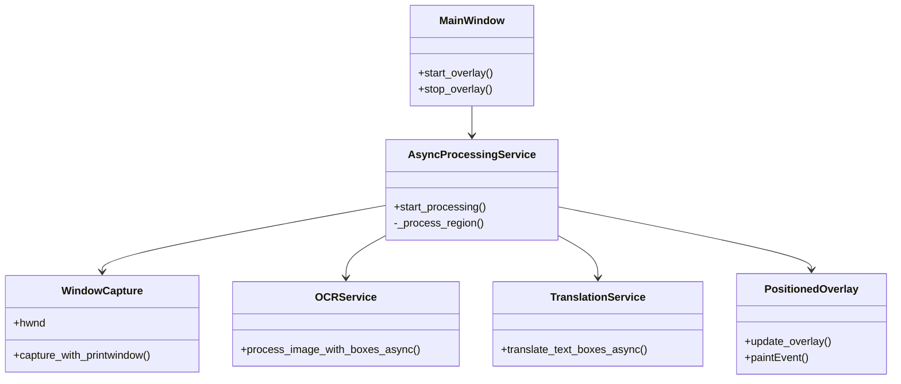

# CHƯƠNG 4: THIẾT KẾ VÀ XÂY DỰNG ỨNG DỤNG

Chương này đi sâu vào chi tiết thiết kế kỹ thuật và quá trình xây dựng ứng dụng. Nội dung bao gồm kiến trúc tổng thể, thiết kế chi tiết các lớp (Class Design), giao diện người dùng (UI), và các giải thuật quan trọng được triển khai trong mã nguồn.

## 4.1. Kiến trúc hệ thống (System Architecture)

Hệ thống được xây dựng theo kiến trúc phân lớp (Layered Architecture) kết hợp với mô hình hướng sự kiện (Event-driven) để xử lý các tác vụ bất đồng bộ. Kiến trúc được chia thành 4 tầng chính:

1.  **Presentation Layer (Tầng Giao diện):** Chịu trách nhiệm hiển thị thông tin và tương tác với người dùng. Bao gồm cửa sổ chính (`MainWindow`) và các lớp phủ dịch thuật (`PositionedOverlay`).
2.  **Application Logic Layer (Tầng Nghiệp vụ):** Điều phối luồng xử lý chính. `AsyncProcessingService` đóng vai trò trung tâm, quản lý vòng lặp chụp ảnh, OCR và dịch thuật.
3.  **Service Layer (Tầng Dịch vụ):** Chứa các module chức năng chuyên biệt như `WindowCapture` (chụp màn hình), `OCRService` (nhận dạng văn bản), và `TranslationService` (dịch thuật).
4.  **Data Layer (Tầng Dữ liệu):** Quản lý lưu trữ cục bộ (`LocalHistoryService`) và đồng bộ đám mây (`FirebaseManager`).

### Sơ đồ Thành phần (Component Diagram)

```mermaid
componentDiagram
    package "Presentation Layer" {
        [MainWindow]
        [PositionedOverlay]
    }
    package "Application Logic" {
        [AsyncProcessingService]
    }
    package "Service Layer" {
        [WindowCapture]
        [OCRService]
        [TranslationService]
    }
    package "Data Layer" {
        [LocalHistoryService]
        [FirebaseManager]
    }

    [MainWindow] --> [AsyncProcessingService] : Start/Stop
    [AsyncProcessingService] --> [WindowCapture] : Capture Frame
    [AsyncProcessingService] --> [OCRService] : Extract Text
    [AsyncProcessingService] --> [TranslationService] : Translate
    [AsyncProcessingService] --> [PositionedOverlay] : Update UI
    [AsyncProcessingService] --> [LocalHistoryService] : Save History
    [LocalHistoryService] --> [FirebaseManager] : Sync
```

## 4.2. Thiết kế chi tiết (Detailed Design)

### 4.2.1. Module Capture (WindowCapture)
Lớp `WindowCapture` chịu trách nhiệm tương tác với Windows API để lấy dữ liệu hình ảnh từ cửa sổ mục tiêu.
*   **Nhiệm vụ:** Lấy handle cửa sổ, chụp ảnh bằng BitBlt, và tính toán dHash.
*   **Phương thức chính:**
    *   `capture_with_printwindow()`: Sử dụng `win32gui` và `win32ui` để copy bitmap từ Device Context.
    *   `get_window_rect()`: Lấy tọa độ và kích thước cửa sổ để định vị Overlay.

### 4.2.2. Module OCR (OCRService)
Lớp `OCRService` bọc (wrap) thư viện Tesseract để cung cấp chức năng nhận dạng văn bản dễ sử dụng.
*   **Nhiệm vụ:** Tiền xử lý ảnh (chuyển xám, tăng tương phản) và gọi Tesseract.
*   **Phương thức chính:**
    *   `process_image_with_boxes_async()`: Chạy OCR trên luồng riêng (ThreadPool) để không chặn UI, trả về danh sách các từ và tọa độ (`left`, `top`, `width`, `height`).

### 4.2.3. Module Translation (TranslationService)
Lớp `TranslationService` đóng vai trò là Factory để lựa chọn và sử dụng các mô hình dịch thuật khác nhau.
*   **Nhiệm vụ:** Quản lý các strategy dịch thuật (Gemini, NLLB, OPUS) và xử lý lỗi mạng.
*   **Phương thức chính:**
    *   `translate_text_boxes_async()`: Nhận danh sách các hộp văn bản (text boxes), gom nhóm (batching) nếu cần, và gửi đến mô hình dịch phù hợp.

### 4.2.4. Module Overlay (PositionedOverlay)
Lớp `PositionedOverlay` kế thừa từ `QWidget` của PyQt6, được thiết kế để hiển thị văn bản dịch đè lên vị trí gốc.
*   **Nhiệm vụ:** Vẽ văn bản với nền bán trong suốt, tự động điều chỉnh kích thước font chữ để vừa với khung hình gốc.
*   **Phương thức chính:**
    *   `update_overlay(text_boxes)`: Nhận dữ liệu dịch và kích hoạt sự kiện vẽ lại (`paintEvent`).
    *   `paintEvent(event)`: Sử dụng `QPainter` để vẽ từng hộp văn bản lên màn hình.

### Sơ đồ Lớp (Class Diagram)



## 4.3. Thiết kế giao diện (User Interface Design)

### 4.3.1. Giao diện chính (Main Window)
Giao diện chính được thiết kế tối giản với PyQt6, tập trung vào tính dễ sử dụng.
*   **Dropdown "Select Window":** Liệt kê tất cả cửa sổ đang mở để người dùng chọn.
*   **Nút "Start/Stop":** Nút bấm lớn để kích hoạt hoặc dừng tính năng Overlay.
*   **Khu vực Log:** Hiển thị trạng thái hoạt động (ví dụ: "Processing...", "Translated 5 items").
*   **Tab "Settings":** Cho phép cấu hình API Key và ngôn ngữ.

### 4.3.2. Giao diện lớp phủ (Overlay)
Giao diện Overlay hoàn toàn trong suốt và không có viền (Frameless).
*   **Cơ chế hiển thị:** Chỉ hiển thị các hộp văn bản (Text Boxes) có nền màu tối (độ mờ 70%) và chữ màu trắng/vàng để dễ đọc trên mọi nền.
*   **Tương tác:** Cho phép chuột đi xuyên qua (Click-through) để người dùng vẫn có thể thao tác với ứng dụng game/video bên dưới bình thường.

## 4.4. Xây dựng và Triển khai

### 4.4.1. Môi trường phát triển
*   **Ngôn ngữ:** Python 3.10
*   **IDE:** Visual Studio Code
*   **Quản lý thư viện:** PIP và Virtual Environment (`venv`).

### 4.4.2. Các thư viện chính
*   `PyQt6`: Xây dựng GUI và Overlay.
*   `pywin32`: Tương tác với Windows API (BitBlt).
*   `pytesseract`: Wrapper cho Tesseract OCR engine.
*   `google-generativeai`: SDK cho Gemini API.
*   `firebase-admin`: SDK cho Firestore.

### 4.4.3. Quy trình đóng gói (Deployment)
Ứng dụng được đóng gói thành file thực thi `.exe` độc lập để chạy trên máy người dùng cuối mà không cần cài đặt Python. Công cụ sử dụng là **PyInstaller**.

Lệnh đóng gói:
```bash
pyinstaller --noconfirm --onedir --windowed --name "OCR-AITranslate" --icon "assets/icon.ico" --add-data "assets;assets" main.py
```
*   `--windowed`: Ẩn cửa sổ Console đen khi chạy.
*   `--onedir`: Gom tất cả vào một thư mục (dễ debug hơn `--onefile`).
*   `--add-data`: Kèm theo các file tài nguyên (ảnh, config).
